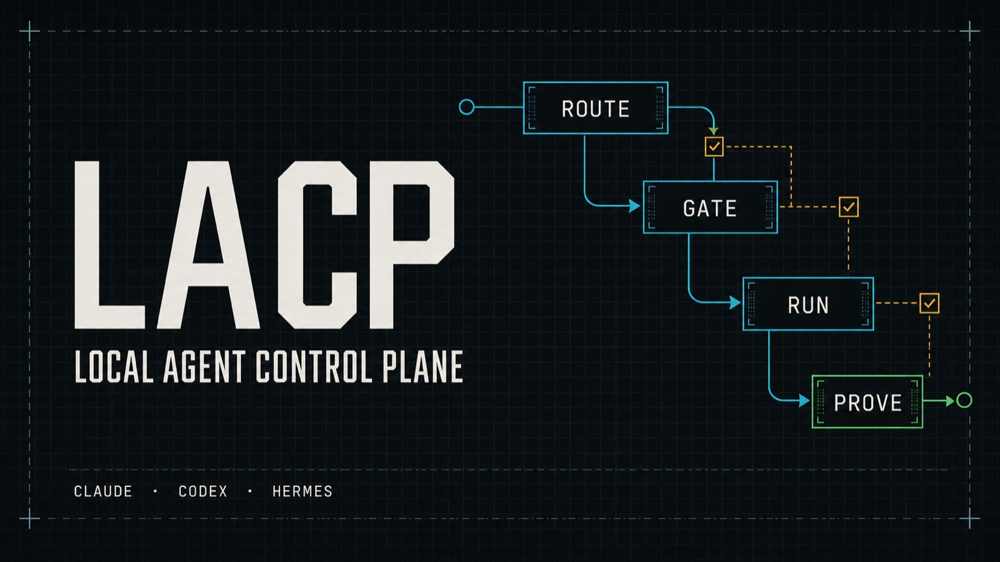
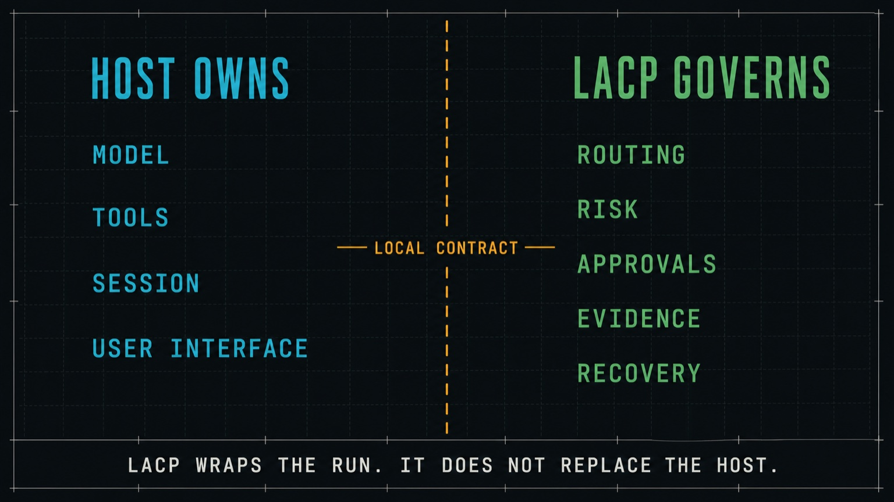
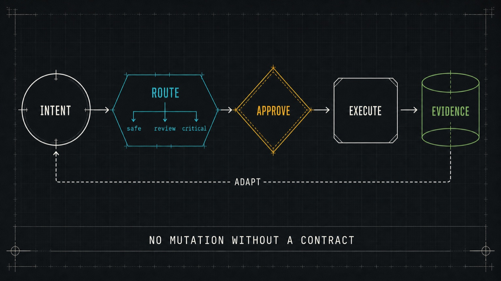
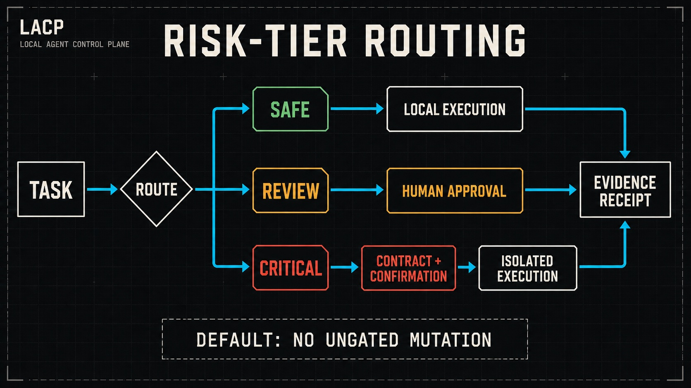
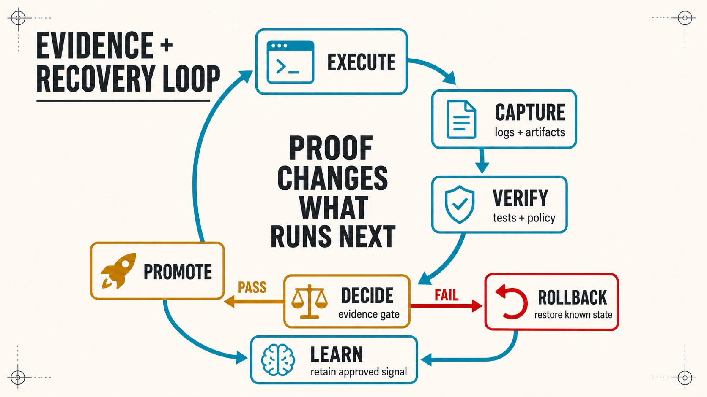

<div align="center">

# LACP

**Local policy, evidence, and recovery controls for coding agents.**

LACP wraps Claude, Codex, Hermes, and other CLI agents with deterministic routing,
approval gates, execution records, memory controls, and rollback paths. It runs on your
machine and keeps remote execution opt-in.

[](https://github.com/0xNyk/lacp)
[](LICENSE)
[](version)
[](https://github.com/0xNyk/lacp/releases/tag/v0.6.0)
[](https://github.com/0xNyk/lacp/commits/main)
[](https://github.com/0xNyk/lacp/issues)
[](https://github.com/0xNyk/lacp)



</div>

---

> **Development status:** `main` reports version 0.10.0. The latest published GitHub and
> Homebrew release is v0.6.0. Main includes unreleased changes and may alter commands or
> configuration before the next release. Use the Homebrew package when you need the
> published release; use `--HEAD` only when you want current development code.

## Contents

- [Quick Start](#quick-start)
- [Why teams adopt LACP](#why-teams-adopt-lacp)
- [Use-case recipes](#use-case-recipes)
- [Documentation](#documentation)
- [Architecture](#architecture)
- [Features](#features)
- [Prerequisites](#prerequisites)
- [Install Options](#install-options)
- [Who It's For](#who-its-for)
- [Testing](#testing)
- [Security](#security)
- [Contributing](#contributing)

## What LACP controls

LACP is a local execution wrapper and control plane. The coding-agent host still owns its
model, tools, session, and interface. LACP owns the contract around a run: where it may
execute, which risk tier applies, when approval is required, what evidence must be kept,
and how a failed change is recovered.



<table>
<tr><td><b>Execution</b></td><td>Risk tiers, budgets, context contracts, session fingerprints, and local or remote sandbox routing.</td></tr>
<tr><td><b>Verification</b></td><td>Browser, API, and contract evidence manifests with PR preflight and release gates.</td></tr>
<tr><td><b>Memory</b></td><td>Session memory, Obsidian workflows, ingestion, optional code intelligence, and provenance.</td></tr>
<tr><td><b>Coordination</b></td><td>Worktree isolation, tmux/dmux sessions, swarm manifests, handoffs, and recovery paths.</td></tr>
</table>

---

## Quick start

### Install

```bash
# Homebrew (recommended)
brew tap 0xNyk/lacp && brew install lacp

# or inspect and run the bootstrap at a published tag
curl -fsSLo /tmp/lacp-install.sh \
  https://raw.githubusercontent.com/0xNyk/lacp/v0.6.0/install.sh
LACP_REF=v0.6.0 bash /tmp/lacp-install.sh
```

### Bootstrap and verify

```bash
lacp bootstrap-system --profile starter --with-verify
lacp doctor --json | jq '.ok,.summary'
```

After bootstrap: `.env` is created, dependencies installed, directories scaffolded, Obsidian vault wired, and verification artifacts produced.

For the full setup and daily operator flow, start with the [Runbook](docs/runbook.md) and [Local Dev Loop](docs/local-dev-loop.md).

### First gated command

```bash
# Route a task through LACP policy gates
lacp run --task "hello world" --repo-trust trusted -- echo "LACP is working"

# Make claude/codex/hermes default to LACP routing (reversible)
lacp adopt-local --json | jq
```



## Why teams adopt LACP

- Route commands through explicit policy and budget gates.
- Keep evidence, provenance, and verification results with each run.
- Leave remote execution disabled until an operator enables it.
- Isolate parallel agents with sessions and Git worktrees.

## Use-case recipes

### 1) Harden local agent usage in under 5 minutes

```bash
lacp bootstrap-system --profile starter --with-verify
lacp adopt-local --json | jq
lacp posture --strict
```

### 2) Run one risky command with explicit policy controls

```bash
lacp run \
  --task "dependency update with tests" \
  --repo-trust trusted \
  --context-profile default \
  -- pnpm up && pnpm test
```

### 3) Generate PR-ready evidence before opening a PR

```bash
lacp e2e smoke --workdir . --init-template --command "npx playwright test --grep @smoke"
lacp api-e2e smoke --workdir . --init-template --command "npx schemathesis run --checks all"
lacp pr-preflight --changed-files ./changed-files.txt --checks-json ./checks.json
```

### 4) Run parallel agents safely on isolated worktrees

```bash
lacp worktree create --repo-root . --name feature-a --base HEAD
lacp up --session feature-a --instances 3 --command "claude"
lacp swarm launch --manifest ./swarm.json
```

---

## Documentation

| Guide | What You'll Learn |
|-------|-------------------|
| [Runbook](docs/runbook.md) | Daily operator workflow, command map, troubleshooting entry points |
| [Local Dev Loop](docs/local-dev-loop.md) | Fast build/test/verify loop for contributors |
| [Framework Scope](docs/framework-scope.md) | What LACP is, what it is not, and design boundaries |
| [Implementation Path](docs/implementation-path-2026.md) | Step-by-step rollout plan for full control-plane adoption |
| [Memory Quality Workflow](docs/memory-quality-workflow.md) | How memory ingestion, expansion, and validation are run safely |
| [Incident Response](docs/incident-response.md) | Triage and recovery flow when policy gates fail |
| [Release Checklist](docs/release-checklist.md) | Pre-release, release, and post-release controls |
| [Troubleshooting](docs/troubleshooting.md) | Common errors, doctor diagnostics, fix hints |

### Project health files

- [CONTRIBUTING.md](CONTRIBUTING.md) - contribution and PR expectations
- [SECURITY.md](SECURITY.md) - vulnerability disclosure process
- [CHANGELOG.md](CHANGELOG.md) - release history
- [LICENSE](LICENSE) - MIT

---

## Architecture

```
lacp/
├── bin/                    # CLI commands (lacp <command>)
│   ├── lacp                # Top-level dispatcher
│   ├── lacp-bootstrap-system
│   ├── lacp-doctor         # Diagnostics (--json, --fix-hints)
│   ├── lacp-route          # Policy-driven tier/provider routing
│   ├── lacp-sandbox-run    # Gated execution with artifact logging
│   ├── lacp-brain-*        # Memory stack (ingest, expand, doctor, stack)
│   ├── lacp-obsidian       # Vault config management
│   ├── lacp-up             # Multi-instance agent sessions
│   ├── lacp-swarm          # Batch orchestration
│   └── lacp-claude-hooks   # Hook profile management
├── config/
│   ├── sandbox-policy.json     # Routing + cost ceilings
│   ├── risk-policy-contract.json
│   ├── obsidian/               # Vault manifest + optimization profiles
│   └── harness/                # Task schemas, sandbox profiles, verification policies
├── hooks/                  # Python hook pipeline for Claude Code
├── scripts/
│   ├── ci/                 # Test suites
│   └── runners/            # Daytona/E2B execution adapters
└── docs/                   # Guides and reference docs
```

### Control Flow

```
Agent invocation
  → lacp route (risk tier + provider selection)
    → context contract validation
      → budget gate check
        → session fingerprint verification
          → sandbox-run (dispatch + artifact logging)
```

## Features

### Policy-Gated Execution

Every command routes through risk tiers (`safe` → `review` → `critical`), budget ceilings per tier, and context contracts that validate host, working directory, git branch, and remote targets before execution.



### 5-Layer Memory Stack

| Layer | Purpose |
|-------|---------|
| **Session memory** | Per-project scaffolding under `~/.claude/projects/` |
| **Knowledge graph** | Obsidian vault with MCP wiring (smart-connections, QMD, ori-mnemos) |
| **Ingestion pipeline** | `brain-ingest` converts text/audio/video/URLs into structured notes |
| **Code intelligence** | GitNexus AST-level knowledge graph via MCP (optional) |
| **Agent identity** | Persistent IDs per (hostname, project) + SHA-256 hash-chained provenance |

```bash
lacp brain-stack init --json | jq          # Bootstrap all layers
lacp brain-ingest --url "https://..." --apply --json | jq
lacp brain-expand --apply --json | jq      # Full expansion loop
```

### Hook Pipeline for Claude Code

Modular Python hooks enforcing quality at every session stage:

| Hook | Event | Purpose |
|------|-------|---------|
| `session_start.py` | SessionStart | Git context injection, test command caching |
| `pretool_guard.py` | PreToolUse | Block dangerous operations (publish, `chmod 777`, fork bombs, secrets) |
| `write_validate.py` | PostToolUse | YAML frontmatter schema validation |
| `stop_quality_gate.py` | Stop | 3-tier eval: heuristics, test verification, local LLM rationalization detection |

Profiles: `minimal-stop`, `balanced`, `hardened-exec`, `quality-gate-v2`. Apply with `lacp claude-hooks apply-profile <profile>`.

### Mycelium Network Memory

Biologically-inspired memory consolidation modeled on fungal networks:

| Mechanism | Description |
|-----------|-------------|
| Adaptive path reinforcement | Frequently-traversed edges strengthen (like mycelium hyphae) |
| Self-healing | Pruned nodes trigger reconnection of orphaned neighbors |
| Exploratory tendrils | Frontier nodes in active categories shielded from pruning |
| Flow scoring | Betweenness centrality identifies critical knowledge hubs |
| Temporal decay | FSRS dual-strength model with forgetting curve |

### Multi-Agent Orchestration

```bash
# dmux-style multi-instance launch
lacp up --session dev --instances 3 --command "claude"

# Git worktree isolation
lacp worktree create --repo-root . --name "feature-a" --base HEAD

# Batch swarm execution
lacp swarm launch --manifest ./swarm.json
```

### Evidence Pipelines

Generate machine-verifiable evidence for PR gates:

```bash
lacp e2e smoke --workdir . --init-template --command "npx playwright test --grep @smoke"
lacp api-e2e smoke --workdir . --init-template --command "npx schemathesis run --checks all"
lacp contract-e2e smoke --workdir . --init-template --command "forge test -vv"
lacp pr-preflight --changed-files ./changed-files.txt --checks-json ./checks.json
```



---

## Prerequisites

| Required | Recommended |
|----------|-------------|
| `bash`, `python3`, `jq`, `rg` (ripgrep) | `shellcheck`, `tmux`, `gh` |

The installer auto-detects and installs missing dependencies on macOS via Homebrew.

## Install options

<details>
<summary><strong>All installation methods</strong></summary>

### Homebrew

```bash
brew tap 0xNyk/lacp
brew install lacp            # published v0.6.0 release
brew install --HEAD lacp     # current main, version 0.10.0
```

### cURL Bootstrap

```bash
curl -fsSLo /tmp/lacp-install.sh \
  https://raw.githubusercontent.com/0xNyk/lacp/v0.6.0/install.sh
LACP_REF=v0.6.0 bash /tmp/lacp-install.sh
```

Change both references to `main` only when you intend to install unreleased development
code. The script also accepts `--dir`, `--profile`, and `--with-verify`; run it with
`--help` before installation to see the full contract.

</details>

## Who it is for

LACP is for developers who need reproducible local agent runs with explicit pass/fail
gates and artifacts that can be inspected after execution.

It is a poor fit when you want a managed cloud service, a chat UI, or a setup with no local
policy and configuration to maintain.

## Testing

```bash
lacp test --quick       # Fast smoke tests
lacp test --isolated    # Full isolated suite
lacp doctor --json      # Structured diagnostics
lacp posture --strict   # Policy compliance check
```

<details>
<summary><strong>Individual test suites</strong></summary>

```bash
scripts/ci/test-route-policy.sh
scripts/ci/test-mode-and-gates.sh
scripts/ci/test-knowledge-doctor.sh
scripts/ci/test-ops-commands.sh
scripts/ci/test-install.sh
scripts/ci/test-system-health.sh
scripts/ci/test-obsidian-cli.sh
scripts/ci/test-brain-memory.sh
scripts/ci/smoke.sh
```

</details>

<details>
<summary><strong>Command reference</strong></summary>

### Core

| Command | Purpose |
|---------|---------|
| `lacp bootstrap-system` | One-command install + onboard + verify |
| `lacp doctor` | Structured diagnostics (`--json`, `--fix-hints`, `--check-limits`) |
| `lacp status` | Current operating state snapshot |
| `lacp mode` | Switch local-only / remote-enabled |
| `lacp run` | Single gated command execution |
| `lacp loop` | Intent → execute → observe → adapt control loop |
| `lacp test` | Local test suite (`--quick`, `--isolated`) |

### Memory & Knowledge

| Command | Purpose |
|---------|---------|
| `lacp brain-stack` | Initialize/audit 5-layer memory stack |
| `lacp brain-ingest` | Ingest text/audio/video/URLs into Obsidian |
| `lacp brain-expand` | Full brain expansion loop |
| `lacp brain-doctor` | Memory-system health checks |
| `lacp obsidian` | Vault config management (audit/apply/optimize) |
| `lacp repo-research-sync` | Mirror repo research into knowledge graph |

### Orchestration

| Command | Purpose |
|---------|---------|
| `lacp up` | dmux-style multi-instance launch |
| `lacp orchestrate` | dmux/tmux/worktree orchestration adapter |
| `lacp worktree` | Git worktree lifecycle management |
| `lacp swarm` | Batch swarm workflow (plan/launch/status) |
| `lacp adopt-local` | Install LACP routing wrappers for claude/codex |

### Security & Policy

| Command | Purpose |
|---------|---------|
| `lacp route` | Deterministic tier/provider routing |
| `lacp sandbox-run` | Gated execution with artifact logging |
| `lacp policy-pack` | Apply policy baselines (starter/strict/enterprise) |
| `lacp claude-hooks` | Audit/repair/optimize hook profiles |
| `lacp security-hygiene` | Secret/path/workflow/.env scan |
| `lacp pr-preflight` | PR policy gate evaluation |

### Release & Evidence

| Command | Purpose |
|---------|---------|
| `lacp release-prepare` | Pre-live discipline (gate + canary + status) |
| `lacp release-verify` | Release verification (checksum + archive + brew) |
| `lacp e2e` | Browser e2e evidence pipeline |
| `lacp api-e2e` | API/backend e2e evidence pipeline |
| `lacp contract-e2e` | Smart-contract e2e evidence pipeline |
| `lacp canary` | 7-day promotion gate over retrieval benchmarks |

### Utilities

| Command | Purpose |
|---------|---------|
| `lacp console` | Interactive slash-command shell |
| `lacp time` | Project/client session time tracking |
| `lacp agent-id` | Persistent agent identity registry |
| `lacp provenance` | Cryptographic session provenance chain |
| `lacp context-profile` | Reusable context contract templates |
| `lacp vendor-watch` | Monitor Claude/Codex version drift |
| `lacp system-health` | macOS/Apple Silicon workstation readiness |
| `lacp mcp-health` | Probe all configured MCP servers |

</details>

## Security

- No secrets in repo config; credentials come from the environment or local `.env`
- Zero external CI by default (`LACP_NO_EXTERNAL_CI=true`)
- Remote execution disabled by default (`LACP_ALLOW_EXTERNAL_REMOTE=false`)
- Risk-tier gating with TTL approval tokens
- Structured input contracts for risky runs
- Artifact logs for auditable execution history
- See [SECURITY.md](SECURITY.md) for vulnerability reporting

## Contributing

Contributions welcome. See [CONTRIBUTING.md](CONTRIBUTING.md) for guidelines.

## Support

If you find this project useful, consider supporting the open-source work:

[](https://buymeacoffee.com/nyk_builderz)

**Solana:** `2k1oq9U99mwy4gm8P2hXPJoZusoXQCpFs35EEf5Ve73y`


---

<div align="center">

**Need agent infrastructure, trading systems, or Solana applications built for your team?**

[Builderz](https://builderz.dev) ships production AI systems across 32+ products in 15 countries.

[Get in touch](https://builderz.dev) | [@nyk_builderz](https://x.com/nyk_builderz)

</div>

## License

[MIT](LICENSE) © 2026 [0xNyk](https://github.com/0xNyk)
