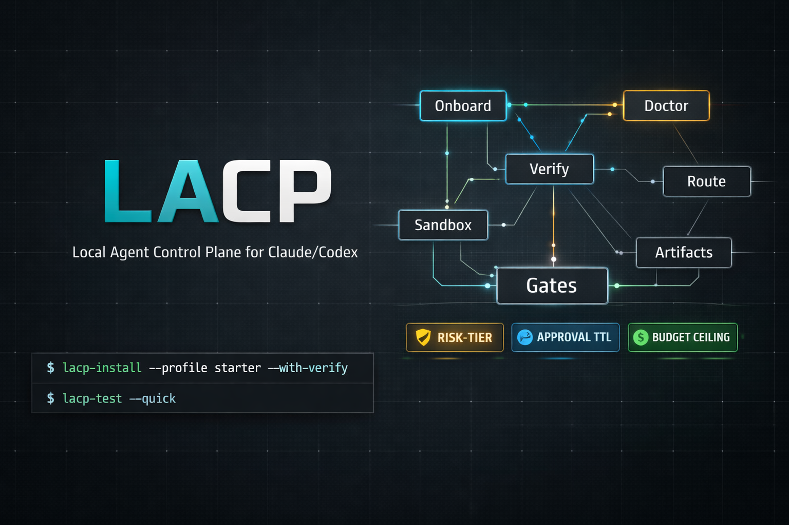

# LACP

[](LICENSE)



Local Agent Control Plane for Claude/Codex.

Status: active development (`v0.1.x`).

LACP turns local agent operations into an auditable system with:
- reproducible onboarding
- verification gates
- policy-based sandbox routing
- artifact-backed health and execution records

LACP is **not** a new runtime. It is a control plane around your existing local automation and agent tooling.

## Table of Contents

- [End Goal](#end-goal)
- [Prerequisites](#prerequisites)
- [Architecture](#architecture)
- [Execution Tiers](#execution-tiers)
- [Risk Tiers](#risk-tiers)
- [Budget Gates](#budget-gates)
- [Quick Start](#quick-start)
- [Daily Developer Workflow](#daily-developer-workflow)
- [Install Options](#install-options)
- [Who It Is For](#who-it-is-for)
- [What Install Does](#what-install-does)
- [5 Minute Smoke Test](#5-minute-smoke-test)
- [Brand Assets](#brand-assets)
- [Remote Setup](#remote-setup)
- [Command Reference](#command-reference)
- [Security Model](#security-model)
- [Artifacts](#artifacts)
- [Testing](#testing)
- [Troubleshooting](#troubleshooting)
- [Optimization Backlog](#optimization-backlog)

## End Goal

Make Claude/Codex operations:
- measurable (benchmarks, snapshots, diagnostics)
- reliable (verification loops, explicit pass/fail gates)
- safe (tiered execution with sandbox policy)
- reproducible (one-command setup and runbook workflows)

## Prerequisites

Required:
- `bash`
- `python3`
- `jq`
- `rg` (`ripgrep`)

Recommended:
- `shellcheck`

## Architecture

### Control-Plane Layer
- `bin/lacp-install`
- `bin/lacp-onboard`
- `bin/lacp-bootstrap`
- `bin/lacp-verify`
- `bin/lacp-doctor`
- `bin/lacp-mode`
- `bin/lacp-status-report`

### Policy + Routing Layer
- policy contract: `config/sandbox-policy.json`
- route decision engine: `bin/lacp-route`
- execution adapter: `bin/lacp-sandbox-run`

### Harness Contract Layer
- task planning schema: `config/harness/tasks.schema.json`
- sandbox profile catalog: `config/harness/sandbox-profiles.yaml`
- verification policy catalog: `config/harness/verification-policy.yaml`

### Remote Provider Layer
- setup helper: `bin/lacp-remote-setup`
- remote smoke helper: `bin/lacp-remote-smoke`
- Daytona runner: `scripts/runners/daytona-runner.sh`
- E2B runner: `scripts/runners/e2b-runner.sh`

## Execution Tiers

- `trusted_local`: known low-risk tasks
- `local_sandbox`: semi-trusted work requiring isolation
- `remote_sandbox`: high-risk/high-compute/long-running tasks

For remote routes, provider is policy-driven (`daytona` or `e2b`), with override support.

## Risk Tiers

- `safe`: executes without approval gate
- `review`: requires valid TTL approval token (`bin/lacp-mode remote-enabled --ttl-min <N>`)
- `critical`: always requires explicit per-run confirmation (`--confirm-critical true`)

## Budget Gates

- Per-tier cost ceilings are configured in `config/sandbox-policy.json` under `routing.cost_ceiling_usd_by_risk_tier`.
- Pass `--estimated-cost-usd <N>` to `bin/lacp-sandbox-run`.
- If estimate exceeds the tier ceiling, run is blocked unless `--confirm-budget true` is explicitly provided.

## Context Contract Gate

- Mutating commands and remote-target commands (`ssh`/`scp`/`rsync`/`sftp`) in `bin/lacp-sandbox-run` require a context contract by default (`LACP_REQUIRE_CONTEXT_CONTRACT=true`).
- Pass `--context-contract '<json>'` with one or more expectations:
  - `expected_host`
  - `expected_cwd_prefix`
  - `expected_git_branch`
  - `expected_git_worktree`
  - `expected_remote_host`
- Example:

```bash
bin/lacp-sandbox-run \
  --task "create local venv" \
  --repo-trust trusted \
  --context-contract '{"expected_host":"my-host","expected_cwd_prefix":"/Users/nyk/control"}' \
  -- python3 -m venv .venv
```

## Quick Start

```bash
cd ~/control/frameworks/lacp
bin/lacp bootstrap-system --profile starter --with-verify
bin/lacp-mode show
bin/lacp-mode remote-enabled --ttl-min 30
bin/lacp-doctor
bin/lacp-verify --hours 24
```

## Daily Developer Workflow

Use this as the default day-to-day flow after install.

### 1. Start session health checks

```bash
cd ~/control/frameworks/lacp
bin/lacp doctor --fix-hints
bin/lacp status --json | jq
```

### 2. Set operating mode

```bash
# local-only (default safe mode)
bin/lacp mode local-only

# or temporary remote mode with explicit TTL
bin/lacp mode remote-enabled --ttl-min 30
```

### 3. Run work through LACP gates

```bash
# single command with routing/risk/budget/context gates
bin/lacp run --task "trusted smoke" --repo-trust trusted -- /bin/echo hello

# one-task control loop (intent -> execute -> observe -> adapt)
bin/lacp loop --task "implement feature X" --repo-trust trusted --json -- <command>
```

### 4. Use isolation for parallel agent work

```bash
# dmux-style: start 3 panes/sessions in one command
bin/lacp up --session dev --instances 3 --command "claude" --json | jq

# add one more instance to the same session later
bin/lacp up --session dev --instances 1 --command "claude" --json | jq

# worktree lifecycle
bin/lacp worktree create --repo-root . --name "feature-a" --base HEAD --json | jq
bin/lacp worktree list --repo-root . --json | jq

# optional orchestrated multi-session runs
bin/lacp orchestrate run --task "parallel batch" --backend dmux --json | jq
bin/lacp swarm launch --manifest ./swarm.json --json | jq
```

### 5. Generate evidence before merge/release

```bash
# browser/web flows
bin/lacp e2e smoke --workdir . --init-template --command "npx playwright test --grep @smoke" --json | jq

# backend/API flows
bin/lacp api-e2e smoke --workdir . --init-template --command "npx schemathesis run --checks all" --json | jq

# smart-contract flows
bin/lacp contract-e2e smoke --workdir . --init-template --command "forge test -vv" --json | jq

# enforce policy gate for current PR context
bin/lacp pr-preflight --changed-files ./changed-files.txt --checks-json ./checks.json --review-json ./review-state.json --json | jq
```

### 6. Final validation + release discipline

```bash
bin/lacp test --isolated
bin/lacp release-prepare --profile local-iterative --json | jq
bin/lacp release-verify --tag vX.Y.Z --quick --skip-cache-gate --skip-skill-audit-gate --json | jq
```

### 7. Optional: make `claude` / `codex` default to LACP routing

```bash
bin/lacp adopt-local --force --json | jq
```

## Install Options

### Homebrew (HEAD from this repo)

```bash
brew tap 0xNyk/lacp
brew install --HEAD lacp
```

### cURL bootstrap

```bash
curl -fsSL https://raw.githubusercontent.com/0xNyk/lacp/main/install.sh | bash
```

Optional flags:

```bash
curl -fsSL https://raw.githubusercontent.com/0xNyk/lacp/main/install.sh | bash -s -- \
  --ref main \
  --profile starter \
  --with-verify true
```

### Verified release install (recommended for production)

```bash
VERSION="0.1.0"
curl -fsSLO "https://github.com/0xNyk/lacp/releases/download/v${VERSION}/lacp-${VERSION}.tar.gz"
curl -fsSLO "https://github.com/0xNyk/lacp/releases/download/v${VERSION}/SHA256SUMS"
grep "lacp-${VERSION}.tar.gz" SHA256SUMS | shasum -a 256 -c -
tar -xzf "lacp-${VERSION}.tar.gz"
cd "lacp-${VERSION}"
bin/lacp-install --profile starter --with-verify
```

## Who It Is For

Use LACP if you want:
- measurable local agent operations (artifacts + diagnostics)
- policy-based execution gates (risk, approvals, budget)
- repeatable onboarding for Claude/Codex workflows

LACP is not for:
- users looking for a chat UI product
- users who do not want to maintain local scripts/config
- teams that need managed cloud orchestration out of the box

## What Install Does

`bin/lacp bootstrap-system --profile starter --with-verify`:
- creates `.env` from template when missing
- auto-detects and installs missing Homebrew dependencies on macOS (disable with `--no-auto-deps`)
- applies the `starter` policy pack defaults (starter profile)
- ensures required root/data paths exist
- scaffolds safe starter automation scripts when missing
- runs onboarding preflight checks
- runs verification and produces baseline artifacts
- runs fresh-machine confidence checks (`lacp-test --quick --isolated` + core command probes)

## 5 Minute Smoke Test

```bash
cd ~/control/frameworks/lacp
bin/lacp install --profile starter --with-verify
bin/lacp test --quick
bin/lacp test --isolated
bin/lacp doctor --json | jq '.ok,.summary'
bin/lacp status --json | jq
```

Expected:
- `lacp-test --quick` exits `0`
- `lacp-test --isolated` exits `0`
- doctor reports `"ok": true`
- status report includes mode + doctor + artifact fields

## Brand Assets

- README banner image path: `docs/assets/readme-banner.png`
- README hero banner prompt: `docs/readme-banner-prompt.md`

## Remote Setup

By default, LACP runs in **zero-external mode**:
- `LACP_LOCAL_FIRST="true"`
- `LACP_NO_EXTERNAL_CI="true"`
- `LACP_ALLOW_EXTERNAL_REMOTE="false"`
- `LACP_REMOTE_APPROVAL_TTL_MIN="30"` (used when granting remote approval)
- remote routes can still be planned/tested via `--dry-run`
- live remote execution is blocked unless explicitly enabled **and** approval is still within TTL
- release gates enforce no active `.github/workflows/*.yml` files while `LACP_NO_EXTERNAL_CI=true`

### Daytona

```bash
cd ~/control/frameworks/lacp
bin/lacp-remote-setup --provider daytona
daytona login
bin/lacp-remote-smoke --provider daytona --json
```

### E2B

```bash
cd ~/control/frameworks/lacp
bin/lacp-remote-setup --provider e2b --e2b-sandbox-id "<running-sandbox-id>"
bin/lacp-remote-smoke --provider e2b --json
```

Notes:
- Default mode is non-interactive lifecycle (`create -> exec -> kill`) using E2B SDK.
- `E2B_SANDBOX_ID` enables existing-sandbox mode via e2b CLI.

## Command Reference

- `bin/lacp`: top-level CLI dispatcher (`lacp <command> ...`)
- `bin/lacp-bootstrap-system`: one-command install + onboard + doctor flow
- `bin/lacp-onboard`: initialize `.env`, run bootstrap, optional full verify
- `bin/lacp-install`: first-time installer (creates roots, starter stubs, then onboard)
- `bin/lacp-install`: auto-detects/install missing macOS/Homebrew dependencies by default (`--no-auto-deps` to skip, `--auto-deps-dry-run` supported)
- `bin/lacp-test`: one-command local test suite (`--quick`, `--isolated` supported)
- `bin/lacp-loop`: deterministic `intent -> execute -> observe -> adapt` control loop wrapper for one task
- `bin/lacp-up`: dmux-style one-command multi-instance launch (`--instances N`) with optional auto-attach
- `bin/lacp-context`: minimal context lifecycle (`init-template`, `audit`, `minimize`, `regression`)
- `bin/lacp-lessons`: add/lint compact self-improvement rules without duplication
- `bin/lacp-optimize-loop`: bounded weekly optimization loop over verify/canary/context/lessons
- `bin/lacp-trace-triage`: cluster recent failed run traces into root-cause groups with deterministic remediation hints
- `bin/lacp-context-profile`: list/render reusable context-contract profiles for safe execution contexts
- `bin/lacp-session-fingerprint`: derive deterministic session fingerprints for anti-drift execution gates
- `bin/lacp-mcp-profile`: list/status/apply MCP operating profiles (`cli-first`, `mcp-selective`, `mcp-heavy`)
- `bin/lacp-report`: summarize recent run outcomes and latest artifact health
- `bin/lacp-canary`: 7-day promotion gate over retrieval benchmarks (hit-rate/MRR/triage/gate consistency)
  - baseline support: `--set-clean-baseline`, `--since-clean-baseline`
- `bin/lacp-canary-optimize`: bounded optimization loop (`verify -> canary`) with optional best `LACP_BENCH_TOP_K` persistence
- `bin/lacp-auto-rollback`: fail-safe rollback action runner (`local-only` mode + wrapper unadopt) on unhealthy canary
- `bin/lacp-schedule-health`: install/status/run-now/uninstall scheduled local health checks via launchd
- `bin/lacp-policy-pack`: list/apply policy baseline packs (`starter`, `strict`, `enterprise`)
- `bin/lacp-release-prepare`: one-command pre-live discipline (`release-gate` + `canary` + `status` + `report`)
  - supports `--profile local-iterative` (equivalent defaults: `--quick --canary-days 3 --skip-cache-gate --skip-skill-audit-gate`)
- `bin/lacp-release-publish`: local-only release artifact builder/publisher (`tar.gz` + `SHA256SUMS` + optional `gh release`)
- `bin/lacp-release-verify`: one-command release verification (`release-publish --skip-gh` + checksum + archive + brew dry-run)
- `bin/lacp-vendor-watch`: monitor local Claude/Codex versions and upstream docs/changelog drift
- `bin/lacp-automations-tui`: unified local automation dashboard (`schedule/orchestrate/worktree/swarm/wrappers/vendor-watch`)
- `bin/lacp-cache-audit`: measure prompt cache efficiency from local Claude/Codex histories
- `bin/lacp-cache-guard`: enforce cache health thresholds (hit-rate + usage events)
- `bin/lacp-skill-audit`: detect risky skill patterns before install/use
- `bin/lacp-skill-factory`: operate auto-skill-factory (`summary/capture/record/lifecycle/recluster/revalidate/migrate-bundles`) with categorized autogen skill bundles
- `bin/lacp-release-gate`: run strict pre-live go/no-go checks (tests + doctor + cache + skills)
- `bin/lacp-pr-preflight`: evaluate PR policy gates (risk tier + docs drift + check runs + stale review state)
- `bin/lacp-harness-validate`: validate `tasks.json` against schema + profile/policy catalogs
- `bin/lacp-harness-run`: execute validated tasks with dependency ordering + loop retries
- `bin/lacp-e2e`: run local Playwright-style e2e command + generate evidence manifest + auth pattern checks
- `bin/lacp-api-e2e`: run API/backend e2e command wrappers with manifest evidence + API coverage checks
- `bin/lacp-contract-e2e`: run smart-contract e2e command wrappers with manifest evidence + invariant/revert checks
- `bin/lacp-browser-evidence-validate`: validate browser evidence manifests with freshness/assertion gates
- `bin/lacp-orchestrate`: optional dmux/tmux/claude_worktree orchestration adapter (still routed through LACP gates)
  - default backend is `dmux` when available; falls back to `tmux`
- `bin/lacp-worktree`: manage git worktree lifecycle (`list/create/remove/prune/gc/doctor`)
- `bin/lacp-swarm`: dmux-first swarm workflow (`init/plan/launch/up/tui/status`) with policy-gated batch execution
  - supports advisory `reservations` per job and reports collisions in plan/artifacts (no hard locks)
  - `swarm status --json` includes `collaboration_summary` with top conflicts for fast triage
- `bin/lacp-migrate`: migrate existing local roots into `.env` (dry-run by default)
- `bin/lacp-incident-drill`: run scenario-based incident readiness drills
- `bin/lacp-workflow-run`: deterministic planner→developer→verifier→tester→reviewer workflow skeleton with explicit `plan->act` handoff token enforcement
- `bin/lacp-adopt-local`: install reversible local `claude`/`codex` wrappers that route through LACP
- `bin/lacp-unadopt-local`: remove LACP-managed local wrappers and restore previous shims
- `bin/lacp-bootstrap`: hard preflight (paths, scripts, policy file)
- `bin/lacp-verify`: memory pipeline + retrieval gates + snapshot + trend refresh
- `bin/lacp-doctor`: structured diagnostics (`--json` supported)
  - runtime pressure diagnostics: `bin/lacp doctor --check-limits --json | jq`
  - actionable remediation commands: `bin/lacp doctor --check-limits --fix-hints --json | jq '.remediation_hints'`
- `bin/lacp-knowledge-doctor`: markdown knowledge graph quality gates (`--json` supported)
- `bin/lacp-mode`: switch/read operating mode (`local-only` vs `remote-enabled`)
- `bin/lacp-mode revoke-approval`: revoke remote approval token immediately
- `bin/lacp-status-report`: generate compact system snapshot (`docs/system-status.md`)
- `bin/lacp-route`: deterministic tier/provider routing with reasons
- `bin/lacp-sandbox-run`: route + risk-tier/budget gates + dispatch + execution artifact logging
- `bin/lacp-remote-setup`: provider onboarding and config wiring
- `bin/lacp-remote-smoke`: provider-aware smoke test with artifact output

## Harness Engineering Contracts

Use these files to formalize your orchestrator workflow from specs to loops:

- `config/harness/tasks.schema.json`: contract for generated `tasks.json` plans.
- `config/harness/sandbox-profiles.yaml`: reproducible sandbox/runtime presets.
- `config/harness/verification-policy.yaml`: per-task verification requirements and thresholds.
- `config/harness/browser-evidence.schema.json`: machine-verifiable browser flow evidence contract.
- `config/risk-policy-contract.json`: single risk/merge/review/evidence policy contract.
- `config/risk-policy-contract.schema.json`: contract schema for drift-resistant validation.
- default policy requires browser/e2e evidence for `medium` and `high` risk tiers.
- policy supports additional scoped evidence gates:
  - `apiEvidence` for API/backend path scopes
  - `contractEvidence` for smart-contract path scopes

This maps directly to:
- spec -> orchestrator-generated tasks
- task -> sandbox profile + verification policy
- loop attempts -> checkable gate outcomes

Validate a generated task plan:

```bash
cd ~/control/frameworks/lacp
bin/lacp harness-validate --tasks ./tasks.json --json | jq
bin/lacp harness-run --tasks ./tasks.json --workdir . --json | jq

# PR preflight policy gate from local evidence files
bin/lacp pr-preflight \
  --changed-files ./changed-files.txt \
  --head-sha "$(git rev-parse HEAD)" \
  --checks-json ./checks.json \
  --review-json ./review-state.json \
  --browser-evidence ./browser-evidence.json \
  --api-evidence ./api-evidence.json \
  --contract-evidence ./contract-evidence.json \
  --json | jq

# local Playwright/e2e evidence pipeline (no external CI cost required)
bin/lacp e2e run \
  --command "npx playwright test" \
  --flows-file ./e2e-flows.json \
  --manifest ./browser-evidence.json --json | jq
bin/lacp e2e auth-check --manifest ./browser-evidence.json --json | jq

# one-liner smoke profile (auto-inits from template if missing)
bin/lacp e2e smoke \
  --workdir . \
  --init-template \
  --command "npx playwright test --grep @smoke" \
  --json | jq

# API/backend smoke harness
bin/lacp api-e2e smoke \
  --workdir . \
  --init-template \
  --command "npx schemathesis run --checks all" \
  --json | jq

# smart-contract smoke harness
bin/lacp contract-e2e smoke \
  --workdir . \
  --init-template \
  --command "forge test -vv" \
  --json | jq

# optional preflight auto-run path
bin/lacp pr-preflight \
  --changed-files ./changed-files.txt \
  --checks-json ./checks.json \
  --review-json ./review-state.json \
  --auto-e2e-run \
  --auto-e2e-command "npx playwright test" \
  --auto-e2e-flows-file ./e2e-flows.json \
  --auto-e2e-auth-check \
  --json | jq
```

## Security Model

- No secrets in repo configuration files
- Environment-driven configuration in `.env`
- Zero-external-cost workflow policy (local CLI gates; no required GitHub Actions or paid CI providers)
- Active GitHub Actions are disabled by default in this repo (`.github/workflows-disabled/` templates)
- Policy-driven remote routing
- External remote execution disabled by default (`LACP_ALLOW_EXTERNAL_REMOTE=false`)
- Risk-tier gating (`safe/review/critical`) with TTL and per-run confirmation controls
- Explicit runner guardrails for remote execution
- Structured input-contract gate for risky runs (`--input-contract ...`)
- Artifact logs for auditable runs
- Cache observability from provider-native history schemas (Codex token_count + Claude usage events)

See:
- `docs/framework-scope.md`
- `docs/runbook.md`
- `docs/release-checklist.md`
- `docs/local-dev-loop.md`
- `docs/implementation-path-2026.md`
- `docs/troubleshooting.md`
- `docs/incident-response.md`
- `CONTRIBUTING.md`
- `SECURITY.md`

## Artifacts

- benchmark reports: `~/control/knowledge/knowledge-memory/data/benchmarks/*.json`
- snapshots: `~/control/automation/ai-dev-optimization/data/snapshots/*.json`
- sandbox runs: `~/control/knowledge/knowledge-memory/data/sandbox-runs/*.json`
- remote smoke runs: `~/control/knowledge/knowledge-memory/data/remote-smoke/*.json`

## Testing

```bash
cd ~/control/frameworks/lacp
./scripts/ci/test-route-policy.sh
./scripts/ci/test-mode-and-gates.sh
./scripts/ci/test-knowledge-doctor.sh
./scripts/ci/test-ops-commands.sh
./scripts/ci/test-install.sh
./scripts/ci/smoke.sh
```

Or use:

```bash
bin/lacp-test
bin/lacp-test --quick
bin/lacp-test --isolated

# pre-live gate
bin/lacp release-gate --quick
bin/lacp canary --json | jq
bin/lacp canary-optimize --iterations 3 --hours 24 --json | jq
bin/lacp canary --set-clean-baseline
bin/lacp canary --since-clean-baseline --json | jq
bin/lacp vendor-watch --json | jq
bin/lacp release-prepare --profile local-iterative --since-clean-baseline --json | jq
bin/lacp release-prepare --quick --skip-cache-gate --skip-skill-audit-gate --since-clean-baseline --json | jq
# optional override when intentionally using GitHub Actions:
bin/lacp release-prepare --allow-external-ci --json | jq
bin/lacp release-publish --tag vX.Y.Z --quick --skip-cache-gate --skip-skill-audit-gate --skip-gh --json | jq
bin/lacp release-verify --tag vX.Y.Z --quick --skip-cache-gate --skip-skill-audit-gate --json | jq

# one-task control loop (includes failure classification + remediation hints in .analysis)
bin/lacp loop --task "trusted smoke" --repo-trust trusted --dry-run --json -- /bin/echo hello

# render reusable context contracts
bin/lacp context-profile list --json | jq
bin/lacp context-profile render --profile local-dev --json | jq
bin/lacp context-profile render --profile ssh-prod --var REMOTE_HOST=jarv --json | jq

# run loop with profile-derived context contract (no raw JSON needed)
bin/lacp loop --task "safe migration prep" --repo-trust trusted --context-profile high-risk-migration --json -- /bin/mkdir -p /tmp/lacp-migration

# minimal context + lessons discipline
bin/lacp context init-template --repo-root . --json | jq
bin/lacp context audit --repo-root . --json | jq
bin/lacp context minimize --repo-root . --json | jq
bin/lacp lessons lint --json | jq

# compare no-context vs minimal-context benchmark outcomes
bin/lacp context regression --none ./none.json --minimal ./minimal.json --json | jq

# bounded weekly optimization loop
bin/lacp optimize-loop --repo-root . --iterations 2 --hours 24 --days 7 --json | jq

# derive and apply session fingerprint
FP="$(bin/lacp session-fingerprint)"
bin/lacp run --task "guarded edit" --repo-trust trusted --context-contract "$(bin/lacp context-profile render --profile local-dev)" --session-fingerprint "${FP}" -- /bin/mkdir -p /tmp/lacp-guarded

# aggregate failed run traces into root-cause clusters
bin/lacp trace-triage --hours 24 --json | jq

# fail-safe rollback if canary is unhealthy
bin/lacp auto-rollback --json | jq

# policy packs
bin/lacp policy-pack list --json | jq
bin/lacp policy-pack apply --pack strict --json | jq

# scheduled local health checks (launchd)
bin/lacp schedule-health install --interval-min 60 --json | jq
bin/lacp schedule-health status --json | jq
bin/lacp schedule-health run-now --json | jq

# fresh macOS dependency bootstrap (enabled by default)
bin/lacp install --profile starter
bin/lacp install --profile starter --no-auto-deps
bin/lacp doctor --fix-deps --auto-deps-dry-run --json | jq

# optional orchestration (dry-run)
bin/lacp orchestrate run \
  --task "parallel coding swarm kickoff" \
  --backend dmux \
  --session "lacp-swarm" \
  --command "echo hello" \
  --repo-trust trusted \
  --dry-run

# claude native worktree isolation through LACP
bin/lacp orchestrate run \
  --task "parallel migration stream" \
  --backend claude_worktree \
  --session "migration-batch-a" \
  --command "audit migration changes and propose safe fixes" \
  --repo-trust trusted \
  --claude-tmux true \
  --dry-run

# explicit worktree lifecycle helpers
bin/lacp worktree doctor --repo-root . --json | jq
bin/lacp worktree create --repo-root . --name "batch-a" --base HEAD --json | jq
bin/lacp worktree list --repo-root . --json | jq
bin/lacp worktree gc --repo-root . --max-age-hours 72 --managed-only true --branch-prefix "wt/" --dry-run --json | jq

# batch orchestration manifest
bin/lacp orchestrate run --batch ./orchestrate-batch.json --json | jq

# dmux-first swarm workflow
bin/lacp swarm init --manifest ./swarm.json --json | jq
bin/lacp swarm plan --manifest ./swarm.json --json | jq
bin/lacp swarm launch --manifest ./swarm.json --json | jq
bin/lacp swarm up --manifest ./swarm.json --json | jq
bin/lacp swarm tui --manifest ./swarm.json --dry-run --json | jq
bin/lacp swarm status --latest --json | jq

# adopt/revert default local command routing
bin/lacp adopt-local --json | jq
bin/lacp unadopt-local --json | jq

# preferred
bin/lacp test
bin/lacp test --quick
bin/lacp test --isolated
```

## Troubleshooting

- `bootstrap failed missing script`: run `bin/lacp-install --profile starter --force-scaffold`
- `fork: Resource temporarily unavailable`: run `bin/lacp doctor --check-limits --json | jq`; reduce concurrent sessions/jobs or raise `ulimit -u` for your user
- get concrete next commands: `bin/lacp doctor --check-limits --fix-hints`
- remote `exit_code=8`: run `bin/lacp-mode remote-enabled --ttl-min 30`
- budget `exit_code=10`: lower `--estimated-cost-usd` or pass `--confirm-budget true`
- critical `exit_code=9`: pass `--confirm-critical true`
- doctor path errors: check `.env` roots and rerun `bin/lacp-doctor --json`

## Optimization Backlog

Prioritized optimization findings are tracked in:
- `docs/optimization-audit-2026-02-20.md`
